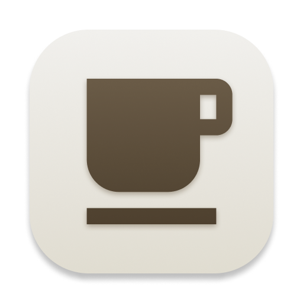

<!-- markdownlint-disable-next-line first-line-h1 -->

  [![Contributors][contributors-shield]][contributors-url]
  [![Forks][forks-shield]][forks-url]
  [![Stargazers][stars-shield]][stars-url]
  [![Issues][issues-shield]][issues-url]
  [![MIT License][license-shield]][license-url]
  [![LinkedIn][linkedin-shield]][linkedin-url]

  

  <h1>Espresso Wallet</h1>

  

    <strong>Free & open-source multi-currency wallet</strong> 
    <a href="https://espressowallet.com">espressowallet.com</a>
  

   
   

A simple, free and beautiful multi-currency tracker app for your daily use. Visualize your spending habits with graphs that break down your finances monthly. Create, delete and edit transactions using gestures, select a date to get historical exchange rates, and much more!

 
 

  <kbd>
    
  </kbd>
  <kbd>
    
  </kbd>
   
   

<!-- TABLE OF CONTENTS -->

  
Table of Contents

  <ol>
    <li><a href="#screenshots">Screenshots</a></li>
    <li><a href="#built-with">Built with</a></li>
    <li><a href="#roadmap">Roadmap</a></li>
    <li><a href="#known-issues">Known issues</a></li>
    <li><a href="#license">License</a></li>
    <li><a href="#contact">Contact</a></li>
  </ol>

## Screenshots

  
  
  
  
  
  

## Built with

- [React.js](https://reactjs.org/)
- [React Router](https://reactrouter.com/)
- [Firebase](https://firebase.google.com/)
- [Redux](https://redux.js.org/)
- [Material UI](https://mui.com/)

## Roadmap

- [x] Login page
- [x] Google auth
- [x] Verfied email auth
- [x] Expense tracking
- [x] Income tracking
- [x] Transaction date filters
- [x] Multi currency support
- [x] Profile page
- [x] Allow account base currency conversion
- [x] Dark mode
- [ ] Internationalization support
- [ ] Recurring incomes/expenses

## Known issues

These are the known issues at the moment. If you find another, please [open an issue](https://github.com/PedroSSM2000/espressowallet/issues), it would be greatly appreciated!

  
Firefox charts don't work

  Expense and income visualization charts don't work on Firefox  
  

  
Safari calendar clipping

  Calendar showing the current month is clipped in Safari idk why  
  

## License

Distributed under the GPL 3.0 License. See `LICENSE` for more information.

## Contact

- [pedrosousa.dev](https://pedrosousa.dev)

<a href="#top">Back to top</a>

[contributors-shield]: https://img.shields.io/github/contributors/PedroSSM2000/espressowallet?style=for-the-badge
[contributors-url]: https://github.com/PedroSSM2000/espressowallet/graphs/contributors
[forks-shield]: https://img.shields.io/github/forks/PedroSSM2000/espressowallet?style=for-the-badge
[forks-url]: https://github.com/PedroSSM2000/espressowallet/network/members
[stars-shield]: https://img.shields.io/github/stars/PedroSSM2000/espressowallet?style=for-the-badge
[stars-url]: https://github.com/PedroSSM2000/espressowallet/stargazers
[issues-shield]: https://img.shields.io/github/issues/PedroSSM2000/espressowallet?style=for-the-badge
[issues-url]: https://github.com/PedroSSM2000/espressowallet/issues
[license-shield]: https://img.shields.io/github/license/PedroSSM2000/espressowallet?style=for-the-badge
[license-url]: https://github.com/PedroSSM2000/espressowallet/blob/main/LICENSE
[linkedin-shield]: https://img.shields.io/badge/-LinkedIn-black?style=for-the-badge&logo=linkedin&colorB=555
[linkedin-url]: https://linkedin.com/in/pedrossdemelo/
